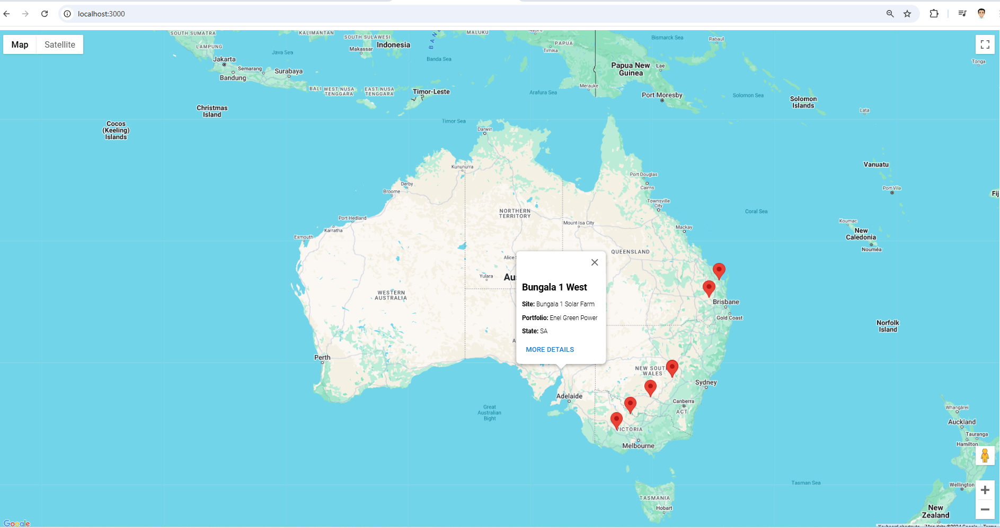
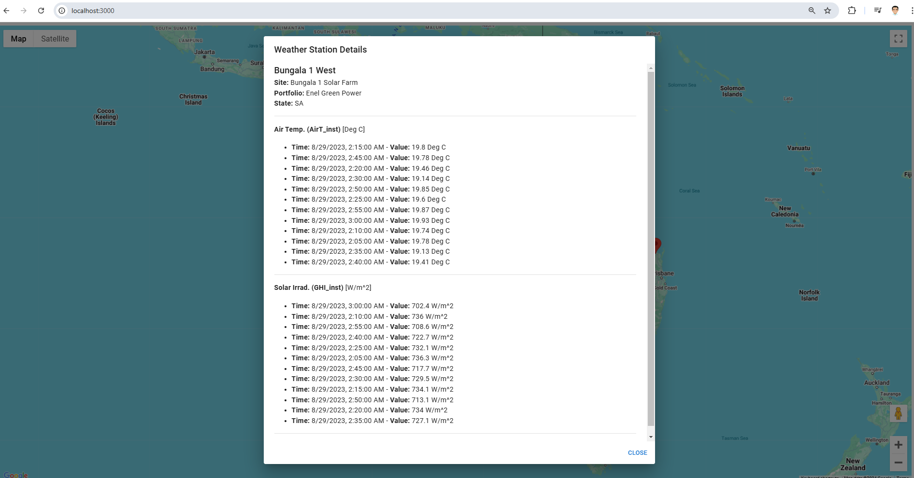

# PROA Coding Challenge Solution

**Time Spent**: 10 hours

## Project Description

This project displays weather stations as markers on a map using a .NET Core API and a React TypeScript client. The application allows users to view weather station details by interacting with map markers.

### Results:
1. **Weather Stations Displayed as Markers on Google Maps**  
   

2. **Detailed Weather Station Dialog**  
   

---

## Implementation Details

### 1. API
**Technologies**:
- .NET Core 8.0
- Entity Framework Core
- AutoMapper
- CSV Helper (for reading CSV files and seeding data into the database)
- PostgreSQL database

The API is responsible for loading data from CSV files and seeding it into a PostgreSQL database. It provides endpoints to fetch weather station data for the client.

---

### 2. Client
**Technologies**:
- React with TypeScript (Vite template)
- React Google Maps API (for map integration)
- Material UI (for UI components)

The client fetches data from the API and displays weather stations on a Google Map. Users can click on the markers to view detailed information about each station.

---

### 3. Docker
**Docker is used to run the PostgreSQL database in a containerised environment.**

#### Key Commands:
- `docker compose up -d`: Start the PostgreSQL database in a new Docker container.
- `docker compose down`: Stop and remove the Docker container, including the database data.

---

## How to Run the Project

### API Setup
1. Ensure you have .NET Core 8.0 installed.
2. Navigate to the `API` folder.
3. Run the following commands:
   ```bash
   dotnet restore
   dotnet run

### Client Setup
1. Navigate to the `client` folder.
2. Install dependencies:
   ```bash
   npm install

3. Start the Vite development server:
   ```bash
   npm run dev

### Docker
Ensure Docker is installed and running.
Use the following commands to manage the PostgreSQL database:
#### Start the database OR Stop and remove the database:
   ```bash
   docker compose up -d
   docker compose down